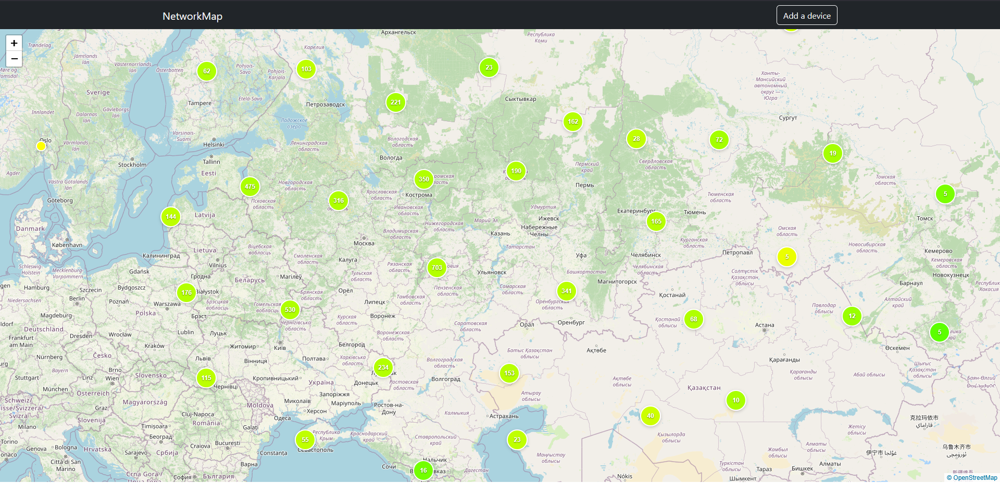

## NetworkMap
A web application for visualizing network devices on an interactive map with clustering functionality.



*Utilizes Leaflet, Leaflet.markercluster (Copyright 2012 David Leaver) and OpenStreetMap tiles.*

## Features

- Interactive map visualization using Leaflet.js
- Smart marker clustering at different zoom levels
- Color-coded markers based on signal quality (0-10 scale)
- Intuitive device addition via map clicks
- Responsive Bootstrap 5 interface
- RESTful API backend with Slim PHP framework
- SQLite database for easy setup

## Prerequisites

- PHP 8.1+
- Composer
- Node.js 14+
- npm
- SQLite3

## Installation

### Backend Setup

1. Navigate to backend directory:

```bash
cd backend
```

2. Install PHP dependencies:

```bash
composer install
```

### Frontend Setup

1. Navigate to frontend directory:

```bash
cd frontend
```

2. Install JS dependencies:

```bash
npm install
```

3. To run build:

```bash
npm run build
```

## Running the Application

### You'll need to run both servers simultaneously:

1. Start backend server (in backend directory):
2. 
```bash
php -S localhost:8080 -t classes
```

2. Start frontend server (in frontend directory):

```bash
 php -S localhost:8000
```

3. Access the application in your browser:
```bash
http://localhost:8000
```
